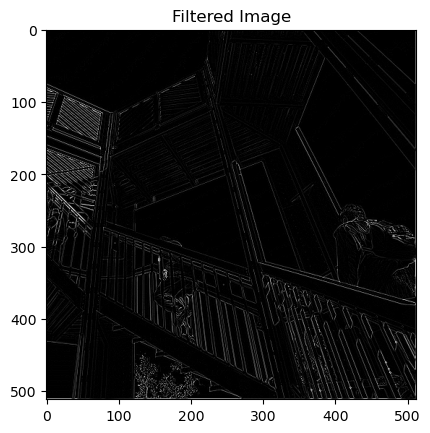
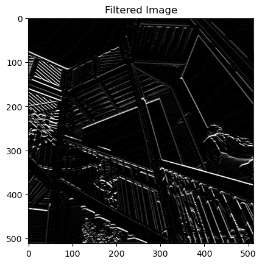
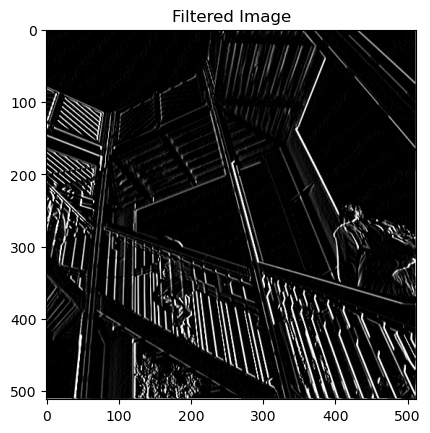
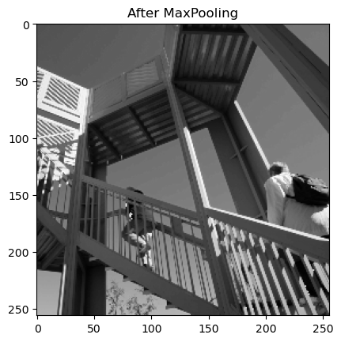
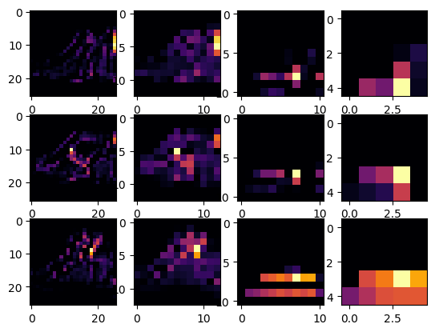

# 🧠 TensorFlow Hands-On Projects

A hands-on repository showcasing real-world deep learning implementations using **TensorFlow** and **Keras**.

---

## 🔗 Table of Contents

- [Computer Vision Example: Fashion MNIST Classification](#computer-vision-example-fashion-mnist-classification)
- [Exploring Convolutions](#exploring-convolutions)
- [Improving Accuracy Using Convolutions](#improving-accuracy-using-convolutions)
- [Improve MNIST with CNN](#improve-mnist-with-cnn)
- [Early Stopping & Callbacks](#early-stopping--callbacks)
- [Handling Complex Images](#handling-complex-images)
- [Visualizing Conv Layers](#visualizing-conv-layers)
- [Dataset Structure](#dataset-structure)
- [Image Assets](#image-assets)
- [Skills Demonstrated](#skills-demonstrated)
- [Setup & Installation](#setup--installation)
- [Future Work](#future-work)

---

## Computer Vision Example: Fashion MNIST Classification

> [`computer_vision_ex.ipynb`](./computer_vision_ex.ipynb)

This notebook demonstrates a step-by-step approach to building and training a neural network for image classification
### Key Features

- Loads and visualizes Fashion MNIST data  
- Preprocesses (normalizes) images  
- Builds a neural network using Keras Sequential API  
- Explains activation functions: ReLU and Softmax  
- Trains and evaluates the model’s accuracy  
- Experiments with different layer sizes for accuracy  
- Implements early stopping with custom callbacks  
---

## Exploring Convolutions

> [`exploring_convolutions.ipynb`](./exploring_convolutions.ipynb)

This notebook demonstrates the fundamentals of convolutions on 2D grayscale images using NumPy, Matplotlib, and SciPy. It uses the built-in "ascent" image from SciPy as an example and guides you through applying various convolution filters and max pooling.

**Visuals**

  
  
  

  
  

---

## Improving Accuracy Using Convolutions

> [`improving_accuracy_using_convolutions.ipynb`](./improving_accuracy_using_convolutions.ipynb)
> 
This Jupyter Notebook demonstrates how to enhance the performance of neural networks by applying convolutional layers. The project explores building and training convolutional neural networks (CNNs) using TensorFlow, focusing on improving accuracy compared to basic dense-layered models. Key steps include data preparation, model construction, training, evaluation, and comparison of results to highlight the benefits of convolutional architectures for image classification tasks.

  

<b>Conv Filter Visual</b>

---

## Improve MNIST with Convolutions  
> [`Improve MNIST with Convolutions.ipynb`](./Improve%20MNIST%20with%20Convolutions.ipynb)

A compact walkthrough of enhancing MNIST digit classification using convolutional layers and early stopping.  
Key steps include:

- Load & preprocess the MNIST dataset  
- Build a CNN with Conv2D, MaxPooling, Flatten & Dense layers  
- Implement early stopping for >99.5% accuracy  
- Visualize training loss & accuracy across epochs  

Efficiently demonstrates the impact of CNNs over dense networks for image-based tasks.

---

## Callbacks & Early Stopping  
> [`callbacks.ipynb`](./callbacks.ipynb)  
> [`early_stop_callbacks.ipynb`](./early_stop_callbacks.ipynb)

Explore how to control training flow using TensorFlow Callbacks.

Key concepts covered:
- Custom callbacks to halt training based on loss/accuracy thresholds  
- Early stopping for efficient training (e.g., stop when accuracy > 98%)  
- Simple neural nets with Fashion MNIST & MNIST datasets  
- Saves time by avoiding overfitting and unnecessary epochs  

Hands-on demos to build smarter training pipelines.

---

## Handling Complex Images (Happy vs Sad Classifier)

> [`Handling Complex Images`](./Handling%20Complex%20Images/)

Build a binary image classifier using CNNs to detect emotions from emoji-like face images.

Key highlights:
- Custom dataset with 80 labeled images (40 happy 😃, 40 sad 😢)
- Convolutional Neural Network (CNN) for binary classification
- Early stopping callback when accuracy reaches 99.9%
- Data preprocessing, normalization, and real-time batch loading
- Model architecture: Conv2D ➝ MaxPool ➝ Flatten ➝ Dense ➝ Sigmoid

📷 **Sample Images:**
| Happy 😃 | Sad 😢 |
|----------|--------|
|  |  |

A practical introduction to real-world emotion detection using TensorFlow CNNs.

---

## Image Preprocessing & Layer Visualization

> [`Visualizing Convolutional Layers.ipynb`](./Visualizing%20Convolutional%20Layers.ipynb)

This notebook walks through image classification (Horse vs. Human) using a custom CNN in TensorFlow, and visualizes what each convolutional layer learns.

- Images organized into `train/` and `val/` folders
- ~500+ samples per class
- Visual preview of sample images

---

### Model & Training
- 5 * Conv2D → MaxPool layers + Dense layers  
- Input: `300x300x3`, Output: binary prediction  
- Trained for 15 epochs  
- Metrics: Accuracy & Loss plotted over time

### Layer Visualization
- Built a model to extract activations from each conv/pool layer
- Feature maps show how the model detects patterns at each depth

| Visualized Activations |
|------------------------|
|  |
|  |
|  |
|  |
### Interactive Prediction
Upload a custom image → Model returns prediction: **Horse** or **Human**

### Highlights
- Clean pipeline from data to training to prediction
- Useful feature map visualizations for model explainability

